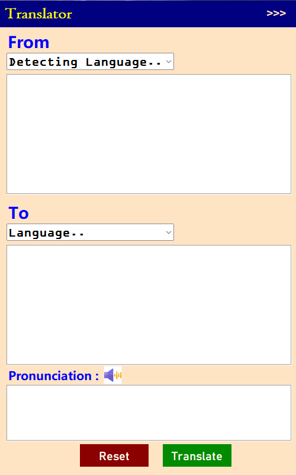
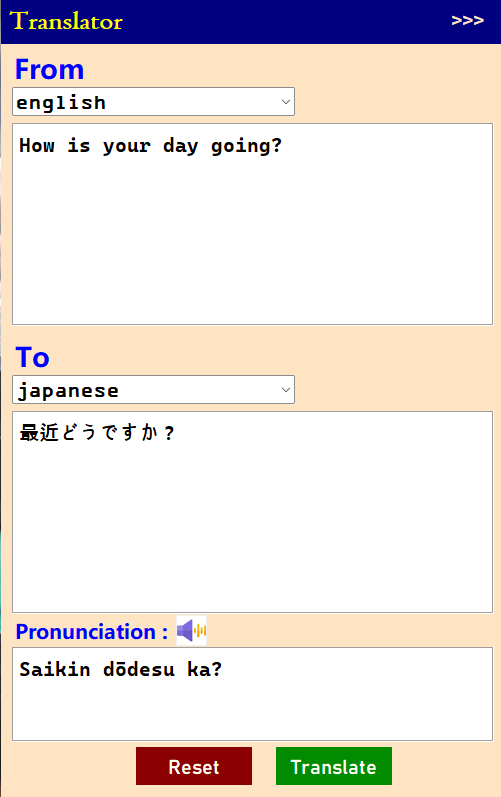
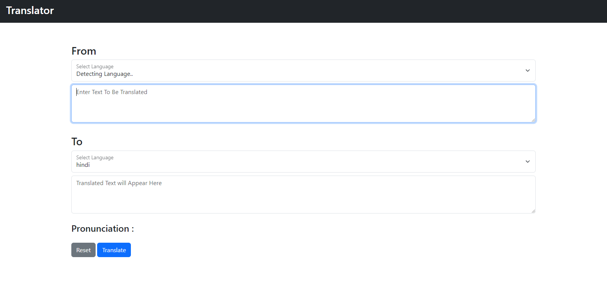
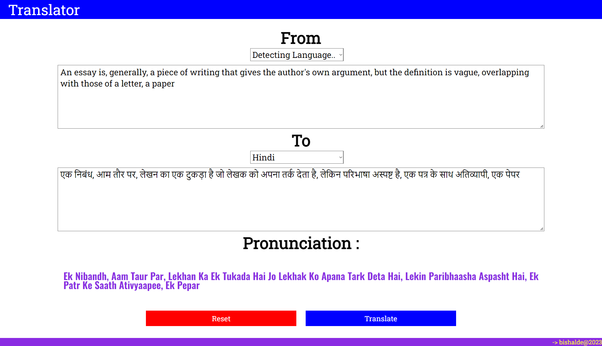

# FullStack Translator Application

This a Translator Application for the Web and PC.

# Features

- Colorful & Interactive GUI
- Cross Platform Application
- Support Many Languages
- Use of Google API

# Tech Stack

**Client:** Bootstrap , Python[Tkinter]

**Backend:** Flask

## Installation

- To start the virtual environment

```bash
/Scripts/activate

```

- To install all the Packages

```bash
pip install -r requirements.txt

```

# Screenshots

#### PC Application :




#### Website :




# Developer

- [@Bishalde](https://www.github.com/BishalDe)

# 🔗 Links

[](https://bishalde.github.io/)

[](https://www.linkedin.com/in/bishalde/)

[](https://instagram.com/bishal_de)

# Support

For support, email bishalde208@yahoo.com or join our call at +91-8299260163.
